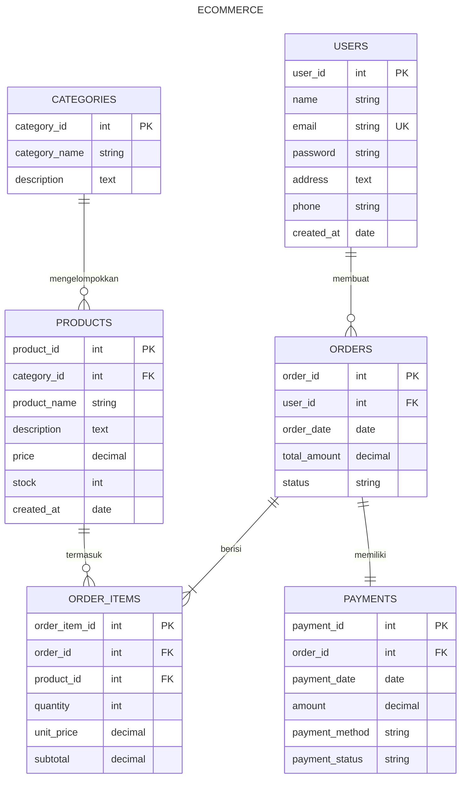
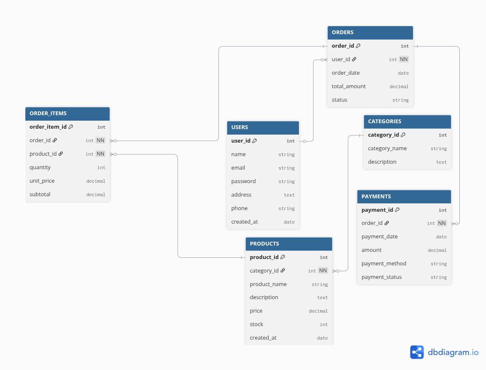

# ERD ECOMMERCE

```mermaid

---
title: ECOMMERCE
---

erDiagram

USERS {
    user_id int PK
    name string
    email string UK
    password string
    address text
    phone string
    created_at date
}

CATEGORIES {
    category_id int PK
    category_name string
    description text
}

PRODUCTS {
    product_id int PK
    category_id int FK
    product_name string
    description text
    price decimal
    stock int
    created_at date
}

ORDERS {
    order_id int PK
    user_id int FK
    order_date date
    total_amount decimal
    status string
}

ORDER_ITEMS {
    order_item_id int PK
    order_id int FK
    product_id int FK
    quantity int
    unit_price decimal
    subtotal decimal
}

PAYMENTS {
    payment_id int PK
    order_id int FK
    payment_date date
    amount decimal
    payment_method string
    payment_status string
}

USERS ||--o{ ORDERS : "membuat"
ORDERS ||--|{ ORDER_ITEMS : "berisi"
PRODUCTS ||--o{ ORDER_ITEMS : "termasuk"
CATEGORIES ||--o{ PRODUCTS : "mengelompokkan"
ORDERS ||--|| PAYMENTS : "memiliki"
```

ERD ECOMERCE : https://dbdiagram.io/d/ecomerce-6aa8eb18957fec6d5bf8b35b
