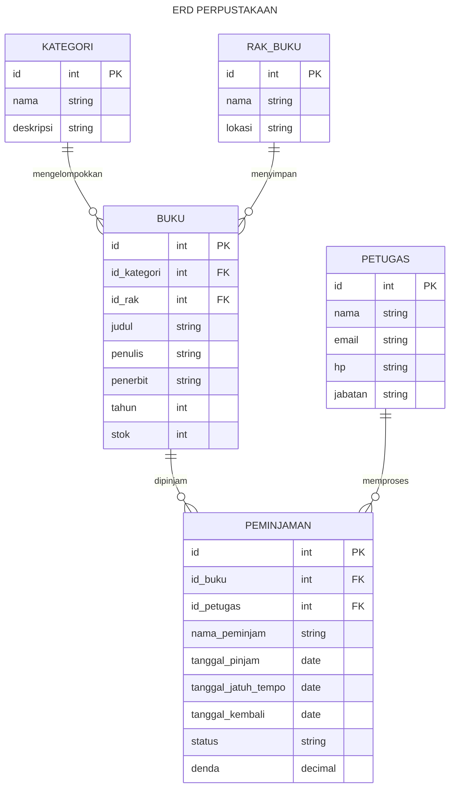

# ERD PERPUSTAKAAN

```mermaid
---
title: ERD PERPUSTAKAAN
---
erDiagram

KATEGORI {
    id int PK
    nama string
    deskripsi string
}
RAK_BUKU {
    id int PK
    nama string
    lokasi string
}
BUKU {
    id int PK
    id_kategori int FK
    id_rak int FK
    judul string
    penulis string
    penerbit string
    tahun int
    stok int
}
PETUGAS {
    id int PK
    nama string
    email string
    hp string
    jabatan string
}
PEMINJAMAN {
    id int PK
    id_buku int FK
    id_petugas int FK
    nama_peminjam string
    tanggal_pinjam date
    tanggal_jatuh_tempo date
    tanggal_kembali date
    status string
    denda decimal
}

KATEGORI ||--o{ BUKU : "mengelompokkan"
RAK_BUKU ||--o{ BUKU : "menyimpan"
BUKU ||--o{ PEMINJAMAN : "dipinjam"
PETUGAS ||--o{ PEMINJAMAN : "memproses"
```

ERD PERPUSTAKAAN : https://dbdiagram.io/d/perpustakaan-6aa93b2efe722b4a39f69355
